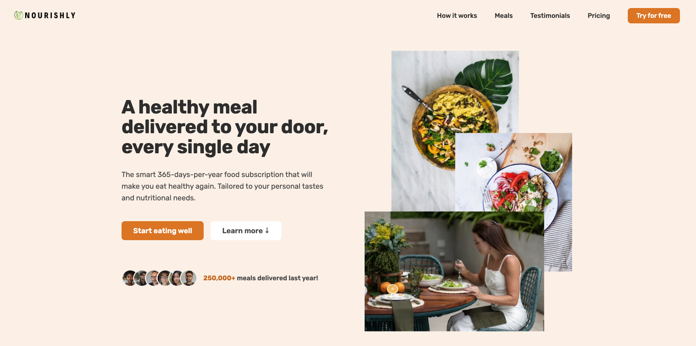

# Nourishly - Food Subscription App
Nourishly is an AI-powered food subcription that will make you eat healthy again, 365 days per year. It's tailored to your personal taste and nutritional needs.



Click this link for a live demo: [Nourishly](https://nourishlyfood.netlify.app/)

## Overview
**Tech Used:** Javascript, HTML, CSS

Nourishly is a clean and responsive webpage designed for a smart, health-focused meal subscription service. It promotes convenient, personalised nutrition — delivering fresh, nutritious meals to your door 365 days a year.

This landing page showcases:

- How It Works – A step-by-step breakdown of the easy onboarding process

- Example Meals – A visual preview of delicious, rotating meals tailored to your taste and nutrition goals

- Testimonials – Honest feedback from happy customers

- Pricing Plans – Simple and flexible subscription options

- Call to Action – A sign-up section encouraging users to try Nourishly for free

Built with HTML, CSS, and JavaScript, this project focuses on clear structure, accessible design, and a strong user flow — aimed at converting visitors into loyal subscribers.

## Lessons learned
To ensure compability across browsers:
- Implement Smooth Scrolling using ```window.scrollTo({behavior:"smooth"})``` 
- Implement Sticky Navigation Bar using ```new IntersectionObserver()``` 
- CSS properties such as ```backdrop-filter``` requiring prefix ```-webkit-backdrop-filter``` for some browsers
- Fix Flexbox Gap compatibility in Safari